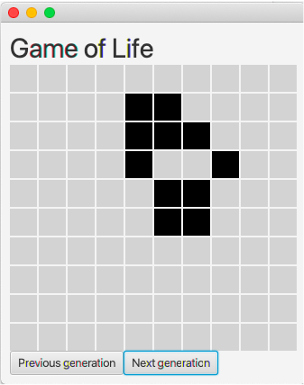
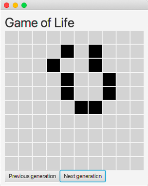
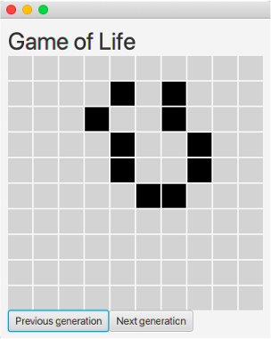
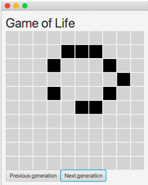

# Conway's Game of Life

- Implemented in Kotlin with TornadoFX

## Screenshots of the first five generations

| The starting cells        | The second generation (Next generation) | The third generation (Next generation) |
| ------------------------- | --------------------------------------- | -------------------------------------- |
|  |                 |                |

| The fourth generation (Next generation) | The third generation (Previous generation) | The fifth generation (Next generation twice) |
| --------------------------------------- | ------------------------------------------ | -------------------------------------------- |
|                |                    |                      |
